# Maigent Agent Web

ローカルで動くDjango製のエージェントチャットWebアプリです。
## 🚧 UNDER CONSTRUCTION 🚀
### ✨ このリポジトリは現在進化中です。いっしょに育てていきましょう！

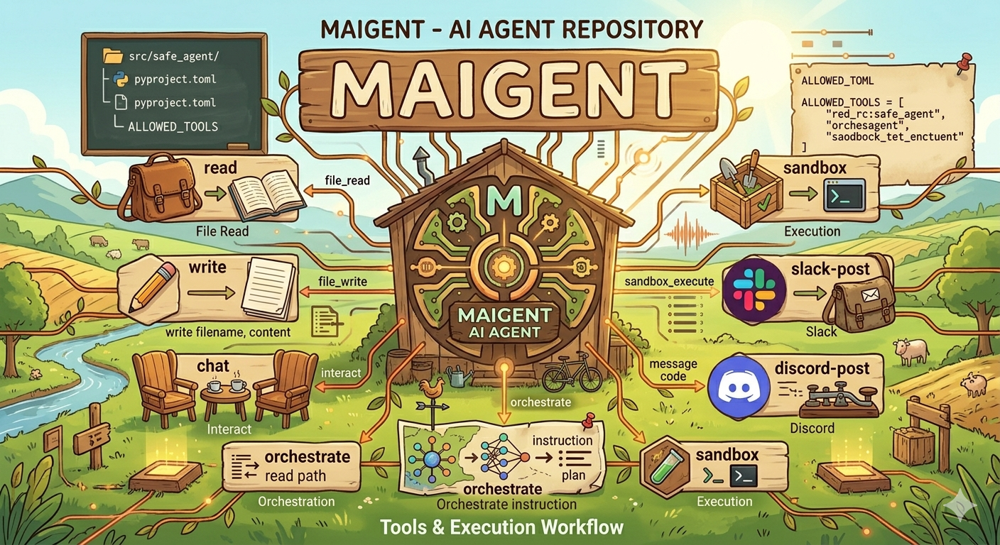

## Setup

```bash
uv sync
uv run python manage.py migrate
docker build -t maigent-sandbox:py311 docker/sandbox
uv run python manage.py runserver
```

設定は `config.toml` または `config.yaml` で管理します。読み込み順は `~/.maigent/`、アプリ直下の `.maigent/`、プロジェクト内の `.maigent/` です。後から読み込まれた設定が前の設定を上書きします。

```yaml
model: gpt-5
api_key: sk-...
base_url: https://api.openai.com/v1
api_mode: auto

llm:
  max_retries: 1

logging:
  llm_tail_chars: 100

final_evaluation:
  enabled: false
  max_retries: 3
  llm_max_retries: 1
  reasoning_effort: none
  max_output_tokens: 8192

tools:
  rag:
    enabled: true
  file_batch:
    enabled: true
  web_search:
    enabled: false
  sandbox:
    enabled: true

tool_selector:
  enabled: true
  reasoning_effort: none
  max_output_tokens: 160
  max_retries: 1

initial_clarifier:
  enabled: true
  reasoning_effort: none
  max_output_tokens: 8192
  llm_max_retries: 1

dynamic_replanner:
  enabled: true
  reasoning_effort: true
  max_output_tokens: 8192
  llm_max_retries: 1

dynamic_finalizer:
  enabled: true
  reasoning_effort: none
  max_output_tokens: 8192
  llm_max_retries: 1

multi_agent:
  enabled: true
  max_workers: 3
  parallel_tools: true
  progress_visible: true

sandbox_code_generation:
  llm_max_retries: 1
```

`providers` を使わない場合は、上記のトップレベル設定をOpenAI互換APIとして扱います。`model` または `default_model` は必須です。`OPENAI_MODEL` はモデル未設定時のみ補完に使われます。APIキーはDBへ保存しません。

`llm.max_retries` は、空応答・`None`・例外が返ったLLM補助呼び出しの共通リトライ回数です。各セクションの `llm_max_retries` で個別に上書きできます。

`logging.llm_tail_chars` は、LLMプロンプトやLLM応答をデバッグログへ出すときの末尾文字数です。標準は `100` です。全文を出す場合は `full`、`all`、`unlimited`、または `0` を指定します。

`final_evaluation.enabled` を `true` にすると、回答をブラウザへ返す前に最終評価を行い、不十分な場合は最初のプランから最大 `max_retries` 回まで再実行します。`max_retries` は 0 から 3 の範囲に丸められます。最終評価のLLM呼び出しは `reasoning_effort`、`max_output_tokens`、`llm_max_retries` で軽量化と応答失敗時の再試行を設定できます。画面から保存した最終評価の有効/無効とリトライ回数はDBの `AppSetting` に保存され、設定ファイル値より優先されます。

`multi_agent.enabled` は、1つのユーザー依頼の内部で複数worker agentを並列実行するかを制御します。標準は有効で、`max_workers` は 1 から 5 の範囲に丸められます。v1では同一スレッドへの複数ユーザー送信を同時処理するのではなく、1つのassistant回答の中で `research` / `compute` / `verify` workerを走らせ、最後に1つの回答へ統合します。`parallel_tools` が `true` の場合、RAGやsandboxなど独立可能なツールをworkerへ分割します。`file_batch` はフォルダ横断タスクをmap-reduceバッチへ分け、必要に応じて `max_workers` まで並列map処理します。`progress_visible` が `true` の場合、ブラウザの進捗欄にagent別の状態を表示します。

プラン作成時の評価基準文は `prompt/evaluation_criteria.txt` から読み込みます。コード側は依頼内容に応じて `base`、`rag`、`sandbox`、`summary`、`list`、`rag_selected` の各セクションを選び、文面はプロンプトファイル側で調整できます。

エージェント実行は、初期プランを `AgentState.plan_queue` に入れ、1タスクごとに実行履歴を保存しながら進めます。回答生成、sandboxコード生成、最終評価にはスレッド内の完了済み会話履歴をすべて入力し、最新ユーザーメッセージを明示します。プラン作成やRAG検索クエリの判定は最新ユーザーメッセージを基準にします。`initial_clarifier.enabled` が `true` の場合、初期プラン前にLLMが不足情報の有無をJSONで判定し、必要なら理由付きの確認質問を返して実行を止めます。`tool_selector.enabled` が `true` の場合、LLMが利用可能tools一覧から `rag` / `file_batch` / `sandbox` / `web_search` / `final` の実行順を短いJSONで選びます。この判定呼び出しは `reasoning_effort: none` と小さい `max_output_tokens` を指定して、低遅延・低コストに寄せています。空応答や不正JSONなどで失敗した場合は `max_retries` 回だけ再試行し、それでも失敗した場合は従来のルールベースプランへフォールバックします。`dynamic_replanner.enabled` が `true` の場合、各タスク後にLLMリプランナーが `goal`、`plan_history`、`task_history`、現在の `plan_queue` を見て、キュー維持・差し替え・終了をJSONで判断します。`dynamic_finalizer.enabled` が `true` の場合、終了時に成果物を保存相当で扱うか、破棄相当で終えるか、追加検証タスクを挿入するかをLLMで分岐します。設定未指定の `RuntimeConfig` ではこれらが有効です。

YAMLローダーはこのアプリ内の簡易実装です。基本的なネスト、真偽値、整数、リストには対応しますが、一般的なYAMLの全機能を使う設定は `config.toml` を推奨します。

## LLM provider configuration

`providers.<name>.enabled` で使用するAPIを切り替えられます。複数を `true` にした場合は `openai`, `ollama`, `lmstudio`, `openrouter`, `azure`, `bedrock` の順で最初に有効なものを使用します。`providers` を書いたうえで全て `false` にした場合、active provider はなしになり、モデル未設定として扱われます。
ちなみに、作者が確認できているのはOpenAI互換APIのみです。

```yaml
providers:
  openai:
    enabled: true
    model: gpt-5
    api_key: sk-...
    api_mode: auto

  ollama:
    enabled: false
    model: llama3.1
    base_url: http://localhost:11434/v1
    api_mode: chat

  lmstudio:
    enabled: false
    model: local-model
    base_url: http://localhost:1234/v1
    api_mode: chat

  openrouter:
    enabled: false
    model: openai/gpt-4o-mini
    api_key: sk-or-...
    base_url: https://openrouter.ai/api/v1
    api_mode: chat
    http_referer: http://localhost:8000
    x_title: Maigent Agent Web

  azure:
    enabled: false
    model: azure-deployment-name
    api_key: azure-key-...
    azure_endpoint: https://your-resource.openai.azure.com
    api_version: 2024-02-15-preview
    api_mode: chat

  bedrock:
    enabled: false
    model: anthropic.claude-3-5-sonnet-20240620-v1:0
    region: ap-northeast-1
    profile: default
    # profileの代わりにキーを設定する場合:
    # aws_access_key_id: ...
    # aws_secret_access_key: ...
    # aws_session_token: ...
```

OllamaとLM StudioはOpenAI互換の `/v1` エンドポイントを使うため、APIキー未指定でもローカル用のダミーキーで接続します。OpenRouterはOpenAI互換APIとして扱い、任意で `http_referer` と `x_title` をヘッダーへ付与できます。Azureは `AzureOpenAI` クライアント、AWS Bedrockは `boto3` の Converse API を使用します。

環境変数も利用できます。OpenAIは `OPENAI_API_KEY` / `OPENAI_BASE_URL`、OpenRouterは `OPENROUTER_API_KEY` / `OPENROUTER_BASE_URL`、Azureは `AZURE_OPENAI_API_KEY` / `AZURE_OPENAI_ENDPOINT`、Bedrockは `AWS_REGION` / `AWS_DEFAULT_REGION` / `AWS_PROFILE` を参照します。Bedrockは設定ファイル内の `aws_access_key_id` / `aws_secret_access_key` / `aws_session_token` も利用できます。

## Tool configuration

`.maigent/config.yaml` の `tools` でツールを管理できます。

```yaml
tools:
  rag:
    enabled: true
  file_batch:
    enabled: true
    max_output_tokens: 4096
    max_retries: 0
    reasoning_effort: none
  web_search:
    enabled: false
    api_key: tvly-...
    max_results: 5
    timeout_seconds: 10
  sandbox:
    enabled: false
    image: maigent-sandbox:py311
    timeout_seconds: 20
    memory_limit_mb: 512
    pids_limit: 128
    cpus: 1
    install_libraries_on_run: false
    allowed_libraries:
      - beautifulsoup4
      - charset-normalizer
      - lxml
      - matplotlib
      - numpy
      - openpyxl
      - pandas
      - pdfplumber
      - pillow
      - pypdf
      - python-docx
      - python-pptx
      - reportlab
      - requests
      - scipy
      - seaborn
      - tabulate
      - xlsxwriter
      - xlrd
```

`sandbox.enabled` を `true` にすると、計算やPython実行が必要そうなメッセージでDocker sandboxを使います。通常は `install_libraries_on_run: false` のままにして、Dockerイメージ側へ必要なライブラリを事前インストールしてください。`true` にするとsandbox実行ごとに `allowed_libraries` を `pip install` するため、起動が遅くなります。

`memory_limit_mb`(既定512、64〜8192)、`pids_limit`(既定128、16〜2048)、`cpus`(既定1、0.1〜8)は、sandboxコンテナに渡す `docker run --memory` / `--pids-limit` / `--cpus` の値です。暴走コードによるメモリ肥大化やフォーク爆弾からホストを守るための上限で、未設定でも既定値が適用されます。

`web_search.enabled` を `true` にし、`api_key`(または環境変数 `TAVILY_API_KEY`)を設定すると、[Tavily](https://tavily.com/) の検索APIを使って最新情報や外部情報を取得します。APIキー未設定の場合は、計画に選択されても「APIキーが未設定です」という明確なメッセージを返し、黙って失敗しません。`max_results`(既定5、1〜10)は取得件数、`timeout_seconds`(既定10、1〜30)はHTTPタイムアウト秒です。この実装は本リポジトリの開発環境ではTavily APIキーを用意できず、ライブ検索の動作確認までは行えていません。実際のキーを設定した上で一度動作確認することを推奨します。

## Sandbox image

Docker sandboxを使う前に、ローカル用イメージを一度ビルドしてください。

```bash
docker build -t maigent-sandbox:py311 docker/sandbox
```

ビルド後、次のコマンドで確認できます。

```bash
docker run --rm maigent-sandbox:py311 python --version
```

`.maigent/config.yaml` の `tools.sandbox.image` が `maigent-sandbox:py311` を指していれば、このアプリはそのイメージを使います。標準の `docker/sandbox/Dockerfile` には、CSV/Excel処理、PDF/Word/PowerPoint処理、グラフ作成、HTML解析、HTTP取得で使う一般的な事務作業向けライブラリを事前インストールしています。ライブラリを追加する場合はDockerfileにも追記し、もう一度 `docker build -t maigent-sandbox:py311 docker/sandbox` を実行してください。実行時インストールが必要な場合だけ `.maigent/config.yaml` で `install_libraries_on_run: true` にします。

Sandboxは許可フォルダを直接マウントしません。ファイル保存が必要な場合、sandbox内のプログラムはstdoutに `maigent_sandbox_result` JSONを出力し、Django側のbrokerが `file_write` feature flag とプロジェクトの書き出し先フォルダを検証してからホスト上に保存します。書き込みはブラウザで指定した書き出し先フォルダ配下に限定され、相対パスはそのフォルダ内として解決されます。これにより、生成コードへ直接書き込み権限を渡さずに成果物だけを保存できます。旧 `maigent_artifacts` 形式は互換用に読み取ります。

RAGで選ばれたCSV/TSV/JSON/TXT/Markdownファイルは、sandboxコード生成時に `rag_1` などのDatasetとして型付きメタ情報を提示します。生成コードはデータ本文を再転記せず、ホスト側が注入する `load_dataset("rag_1")`、`dataset_text("rag_1")`、`dataset_meta("rag_1")` を使います。これにより、CSV区切り文字や列名がLLMの再転記で壊れる問題を避けます。

## Program flow

### 全体構成

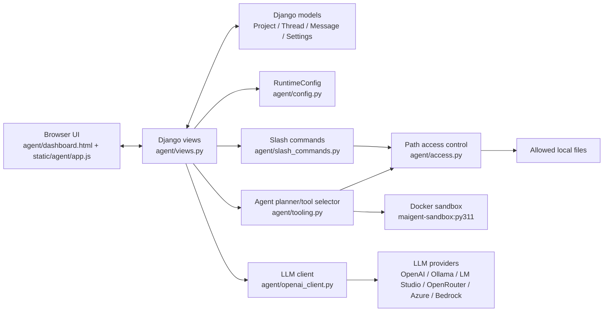

### 起動・初期表示

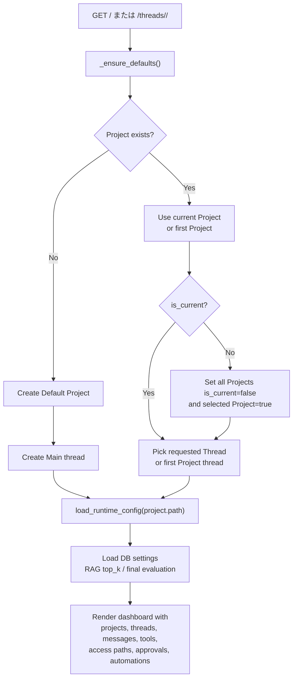

### 設定ファイル読み込みとプロバイダ選択

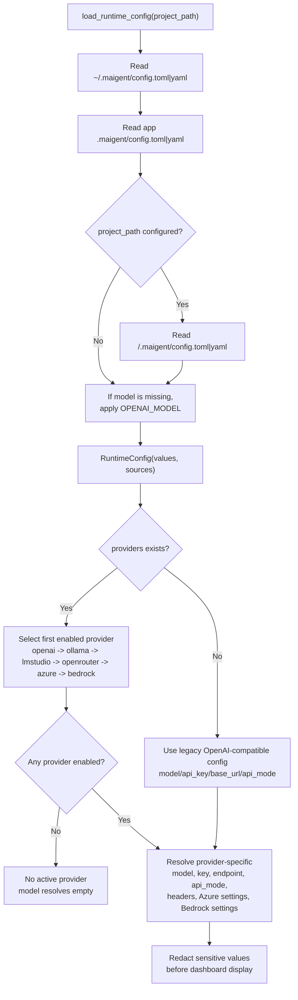

### LLM client分岐

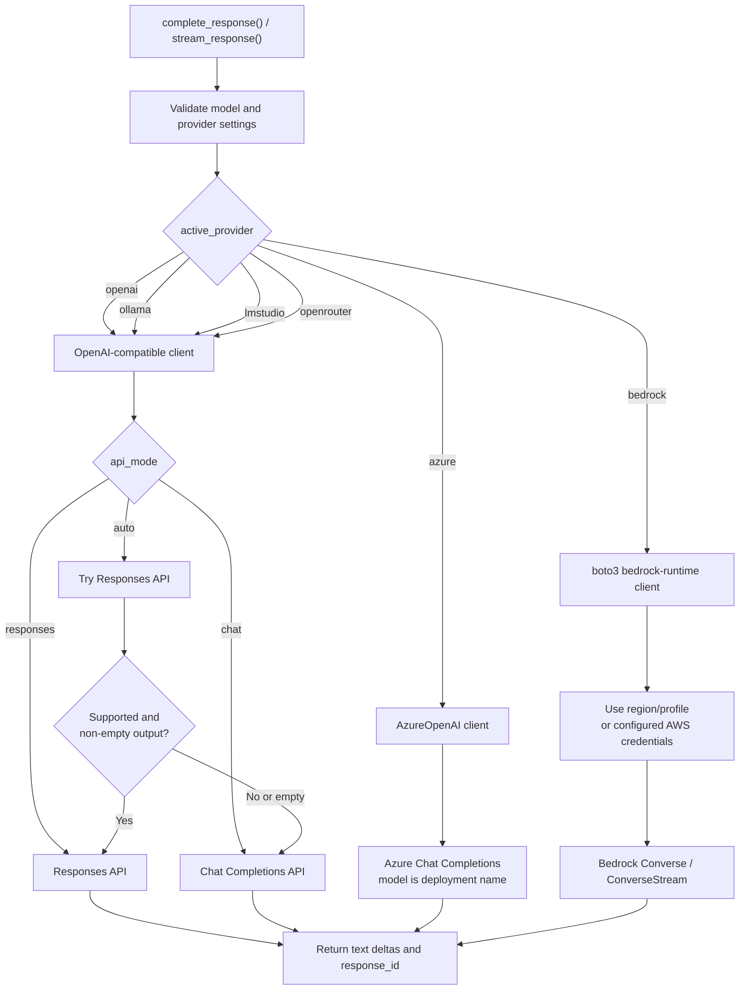

### メッセージ送信から回答生成

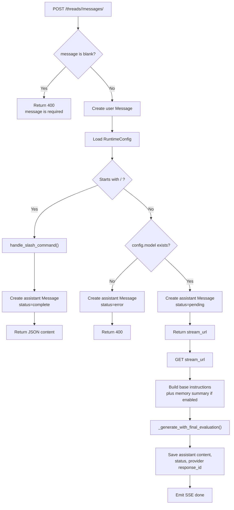

### エージェント計画とツール実行

```mermaid
flowchart TD
    GenerateOnce["_generate_once()"] --> Clarifier{"initial_clarifier enabled\nand not an obvious actionable tool plan?"}
    Clarifier -- "Yes" --> ClarifyLLM["Ask LLM for missing-info JSON"]
    ClarifyLLM --> NeedClarify{"needs_clarification\nand questions exist?"}
    NeedClarify -- "Yes" --> ReturnQuestions["Return assistant message\nwith reason and up to 3 questions\nwithout creating AgentRun"]
    NeedClarify -- "No / empty / invalid" --> ToolSelectorCheck
    Clarifier -- "No" --> ToolSelectorCheck{"tool_selector enabled\nand tools available?"}
    ToolSelectorCheck -- "Yes" --> SelectTools["Ask LLM for tool plan JSON\nrag / file_batch / sandbox / web_search / final"]
    SelectTools --> ValidTools{"Valid non-empty plan?"}
    ValidTools -- "Yes" --> LLMPlan["Use LLM-selected plan\nand avoid duplicate final"]
    ValidTools -- "No" --> BuildPlan
    ToolSelectorCheck -- "No" --> BuildPlan["build_agent_plan()"]
    BuildPlan --> WebSearch{"web_search enabled\nand current/external topic?"}
    WebSearch -- "Yes" --> AddWeb["Add web_search step\nTavily API if api_key configured"]
    WebSearch -- "No" --> RagCheck
    AddWeb --> RagCheck{"rag enabled\nand local context likely?"}
    RagCheck -- "Yes" --> AddRag["Add rag step"]
    RagCheck -- "No" --> SandboxCheck
    AddRag --> SandboxCheck{"sandbox enabled\nand computation/code likely?"}
    SandboxCheck -- "Yes" --> AddSandbox["Add sandbox step"]
    SandboxCheck -- "No" --> AnyStep{"Any tool step?"}
    AddSandbox --> AnyStep
    AnyStep -- "No" --> Direct["Add final step"]
    AnyStep -- "Yes" --> MaybeRagLLM
    Direct --> MaybeRagLLM["_apply_llm_rag_decision()\nonly for direct-answer plans with\nallowed local context sources"]
    LLMPlan --> AvoidFailed["_avoid_failed_plan()"]
    MaybeRagLLM --> AvoidFailed
    AvoidFailed --> Execute["_execute_agent_plan()\ncreate AgentState with dynamic queue"]
    Execute --> PopTask["Pop one task from plan_queue"]
    PopTask --> RunTask["Run one tool task"]
    RunTask --> Record["Append TaskExecutionRecord"]
    Record --> Replan["_replan_after_step()\nkeep / replace / finish"]
    Replan -- "keep/replace and queue remains" --> PopTask
    Replan -- "finish or queue empty" --> FinalRoute["_route_final_output()\nsave / discard / add_tasks"]
    FinalRoute -- "add_tasks" --> PopTask
    FinalRoute --> FinalMessage{"Tool returned final message?"}
    FinalMessage -- "Yes" --> ReturnTool["Return tool result as assistant content"]
    FinalMessage -- "No" --> LLMAnswer["Call stream_response()\nfor final answer"]
```

### RAG処理

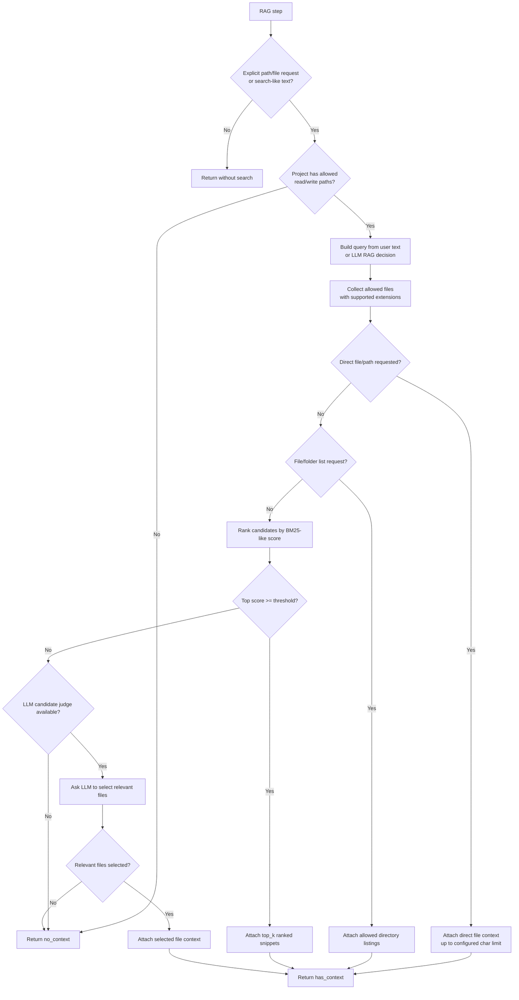

### Sandbox処理

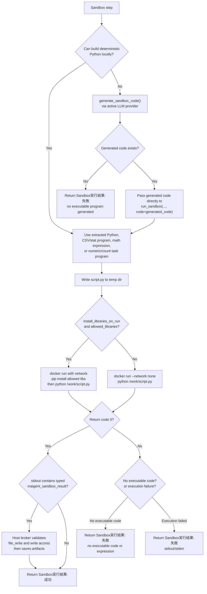

### 最終評価リトライ

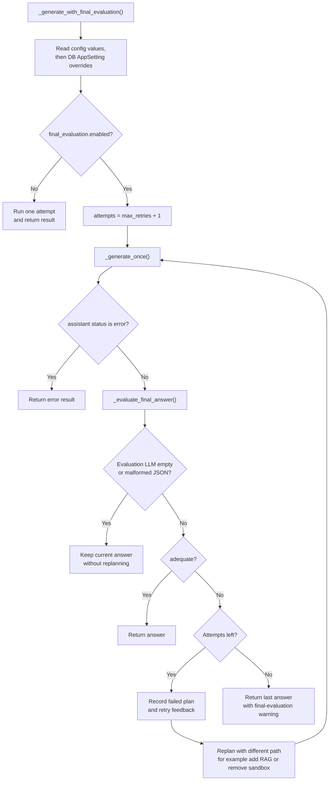

### スラッシュコマンドとファイルアクセス

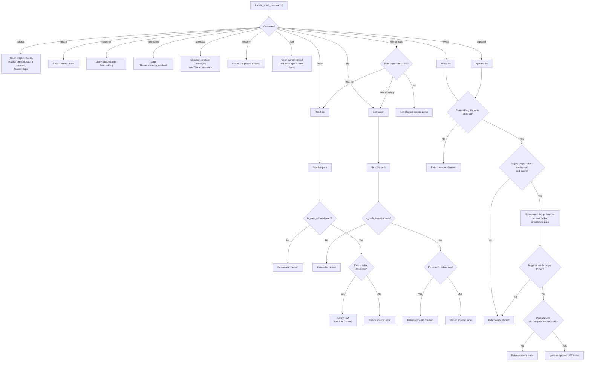

### プロジェクト、スレッド、承認、アクセス許可

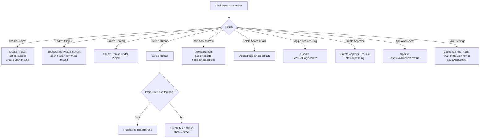
